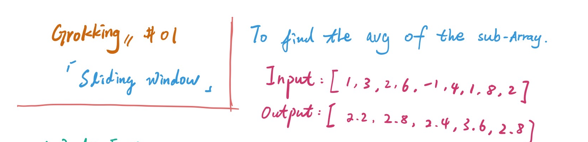
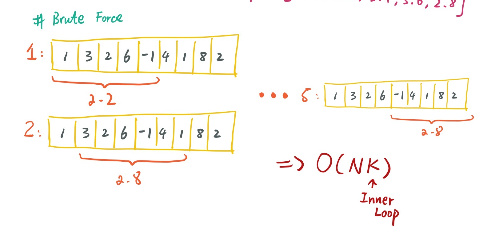
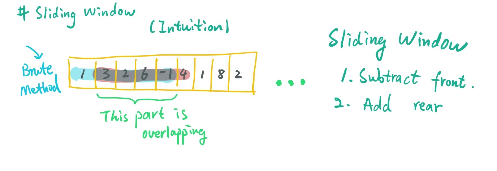

# Grokking the coding interview

## If u unfortunately read this...

这只是一只菜鸡开始刷leetcode的心路历程以及记录，我会把学习过程中的思路和想法记录下来，也会用可视化的方法把方法尽可能画出来（花里胡哨的笔记x），希望能成为一名高冷、无情的做题机器（bushi）。

## Sliding Window

### 概念

遇到一些关于数组、相邻子数组的问题时，可以运用 **滑动窗口** 的方法进行解决，滑动窗口的好处暂时我认为是能够保存具有某段长度的历史信息，省去冗余重复的计算。按照课程的Intro，就从**找到数组中子数组的平均值** 为例子好了。



怎么看也是大一计算概论中比较简单的入门题（x ，一般来讲，比较无脑的做法是给定子数组长度 K，我们做两重循环，外层循环控制最后的输出长度，内层循环控制最后的输出内容，在内层循环每次把元素加起来除以K就可以得到最后答案$Output_{i}$。这样的做法好处只有一个，就是直观易懂哈哈。但是其时间复杂度是比较不行的，假设输入数组长度为 N，子数组长度为K，那么算法的时间复杂度就是$O(N*K)$。

这样可不行，面试官肯定问你要怎么优化的，那咋整啊。这时候我们的主角 **滑动窗口** ，还不能出场。我们先看Intuition，我们刚才的方法十分糟糕，我们叫它SuperBad方法好了，简称 $SBMethod$ , 我们发现在外层循环中，每两次计算中，我们选中的区域，是有重叠的部分的，而这表明在内层产生了重复的计算。



> *重复计算、冗余，这些都是面试官会找你麻烦的东西。——吟游码农迪克*

而且我们发现，计算两次平均值的时候，差异就在于最前面的元素被剔除了，最后的元素被加进来了，这时候主角就可以登场了，滑动窗口每次向右平移一格，自然就是我们前面所说的模式了。这样的话，我们只需要维护第一个元素和最后一个元素就好了，可以用队列实现，但是课程中的代码是比较朴素的实现方法，并不涉及数据结构，这样的方法能够在$O(N)$的时间内进行。

代码在这里

```python
#brute force
def find_average_of_subarray(K,arr):
    result = []
    for i in range(len(arr) - K + 1):
        _sum = 0.0
        for j in range(i,i+K):
            _sum += arr[j]
        result.append(_sum/K)
    return result

#sliding window
def find_avg_slidingVer(K,arr):
    result = []
    _sum = 0.0
    front = 0
    for i in range(len(arr)):
        _sum += arr[i]
        if i >= K - 1:
            result.append(_sum/K)
            _sum -= arr[front]
            front += 1
    return result


def main():
    K = 5
    result = find_average_of_subarray(K,[1,3,2,6,-1,4,1,8,2])
    result_2 = find_avg_slidingVer(K,[1,3,2,6,-1,4,1,8,2])
    print(f"Average of subarray of size {K}: " + str(result))
    print(f"Average of subarray of size {K}: " + str(result_2))
main()

```

